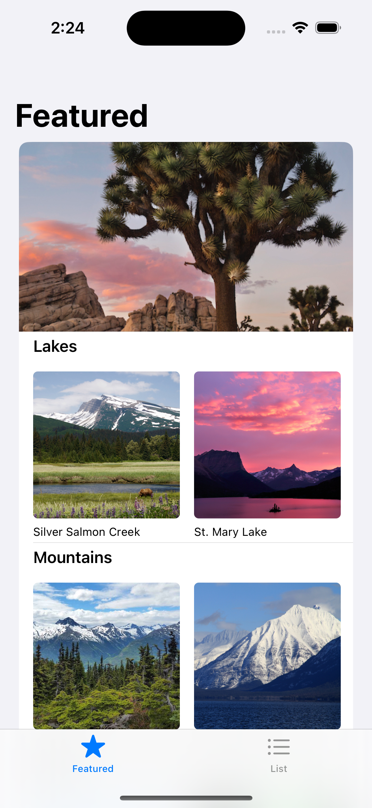
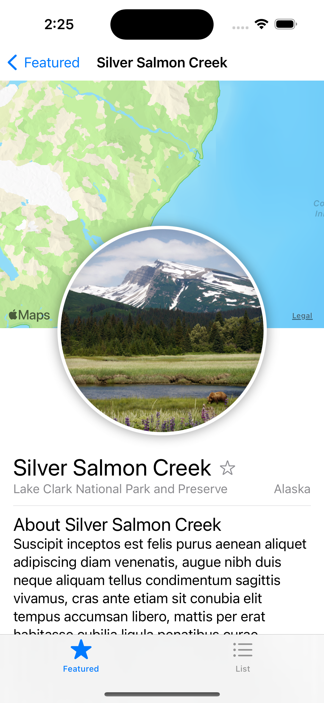
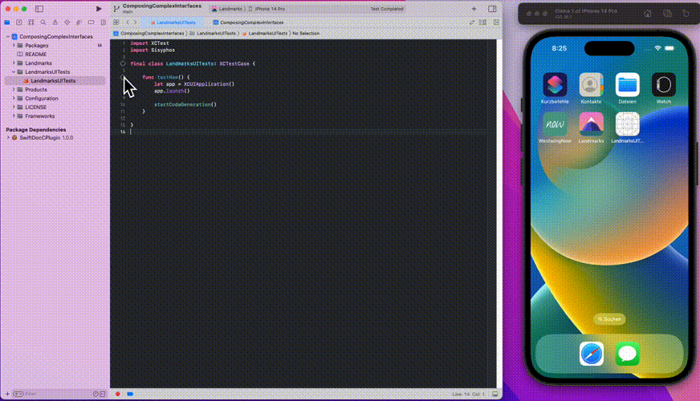
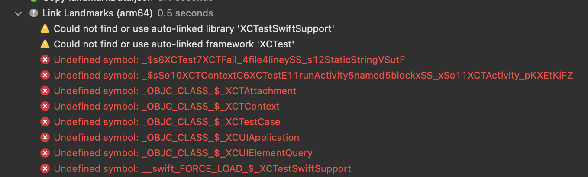

# Sisyphos - Declarative end-to-end and UI testing for iOS and macOS


Sisyphos uses a declarative syntax, 
so you can simply state how the user interface of your app under test should look like. 
Your code is simpler and easier to read than ever before, saving you time and maintenance.

There's no need for manually tweaking sleeps or timeouts. 
And no need to write imperative code to wait for elements to appear.
Your tests will wait automatically exactly as long as needed to have all elements on the screen.
As soon as the elements appear, the tests will interact with them and continue.

Sisyphos builds on top of Apple's [XCTest framework](https://developer.apple.com/documentation/xctest/user_interface_tests).
Therefore, no extra software or tooling is needed and the risk of breaking with new Xcode or 
Swift versions is limited.

## Example

Let's say you want to write a test for the [Landmarks app](https://developer.apple.com/tutorials/swiftui/composing-complex-interfaces).

You want to test that it shows the correct featured lakes and that after tapping on one of the lakes, it will navigate
to the correct page.

|  |  |
|--------------------------------------------------------|-----------------------------------------------------------------|

```swift
import XCTest
import Sisyphos

final class LandmarksUITests: XCTestCase {

    func testFeaturedNavigation() {
        let app = XCUIApplication()
        app.launch()

        let homepage = Homepage()
        homepage.waitForExistence()
        homepage.silverSalmonCreekLake.tap()

        let silverSalmonCreek = SilverSalmonCreekPage()
        silverSalmonCreek.waitForExistence()
    }
}

struct Homepage: Page {

    let silverSalmonCreekLake = Button(label: "Silver Salmon Creek")

    var body: PageDescription {
        NavigationBar(identifier: "Featured") {
            StaticText("Featured")
        }
        CollectionView {
            Cell {}
            Cell {
                StaticText("Lakes")
                silverSalmonCreekLake
                Button(label: "St. Mary Lake")
                Button(label: "Twin Lake")
                Button(label: "Rainbow Lake")
                Button(label: "Hidden Lake")
                Button(label: "Lake Umbagog")
            }
            Cell {
                StaticText("Mountains")
                Button(label: "Chilkoot Trail")
                Button(label: "Lake McDonald")
                Button(label: "Icy Bay")
            }
        }
        TabBar {
            Button(label: "Featured")
            Button(label: "List")
        }
    }
}

struct SilverSalmonCreekPage: Page {
    var body: PageDescription {
        NavigationBar(identifier: "Silver Salmon Creek") {
            Button(label: "Featured")
            StaticText("Silver Salmon Creek")
        }
        StaticText("Silver Salmon Creek")
        Button(label: "Toggle Favorite")
        StaticText("Lake Clark National Park and Preserve")
        StaticText("Alaska")
        StaticText("About Silver Salmon Creek")
        TabBar {
            Button(label: "Featured")
            Button(label: "List")
        }
    }
}
```

Please see [Sisyphos' documentation](https://sisyphostests.github.io/documentation/sisyphos/) for further reference on
how to write tests with Sisyphos.

## Code generation

Instead of building the descriptions of the screens yourself, Sisyphos can automatically generate the code for you. 
Call `startCodeGeneration()` inside of an `XCTestCase`. Sisyphos will then record any new screen
which will appear and add the screens' source code at the end of the file while you manually browse through the app.



## Integrating Sisyphos to your project

Sisyphos is distributed via the [Swift Package Manager](https://www.swift.org/getting-started/#using-the-package-manager) 
with the repository URL `https://github.com/SisyphosTests/sisyphos`.

Please refer to [Apple's documentation](https://developer.apple.com/documentation/xcode/adding-package-dependencies-to-your-app)
on how to add a Swift package dependency to your app.

⚠️ Please make sure to add the `Sisyphos` library to your app's UI test target, not the app target itself! If you see 
errors such as the errors below when building the app, then you added the Sisyphos library to the wrong target. 

